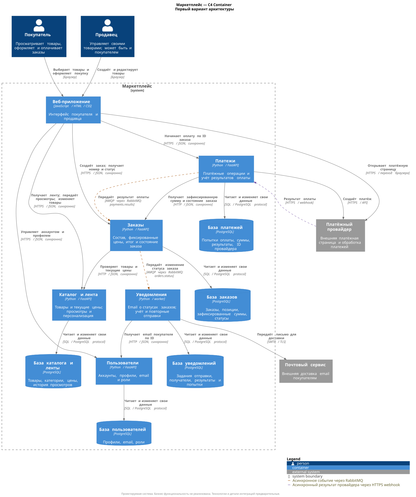

# hse-soa-marketplace

Учебный проект по сервис-ориентированным архитектурам

## Архитектура

5 сервисов: пользователи, каталог и лента, заказы, платежи, уведомления. У каждого сервиса собственная база. Создание заказа синхронное; результаты оплаты и изменения статусов передаются асинхронно через RabbitMQ. Уведомления отправляются по email



[Архитектурные решения и допущения тут](docs/architecture.md)


## Запуск
(P.S. Я запускаю на macos с colima)

Из корня репозитория:

```bash
make run
```

```bash
curl -i http://127.0.0.1:8000/health
```

```bash
make stop
```


## Инструменты

- Python 3.14, FastAPI и Uvicorn для HTTP-сервиса.
- Docker
- PlantUML со встроенной библиотекой C4 для диаграмм.

## Структура

```text
docs/diagrams/       исходники C4 в формате .puml и изображения .svg
services/orders/   минимальный сервис заказов с /health
Dockerfile         сборка и запуск сервиса заказов
Makefile           команда make run
tools/render-c4.sh  преобразование .puml в .svg через Docker
requirements.in    прямые зависимости
requirements.txt   зафиксированные версии всех установленных зависимостей
```
